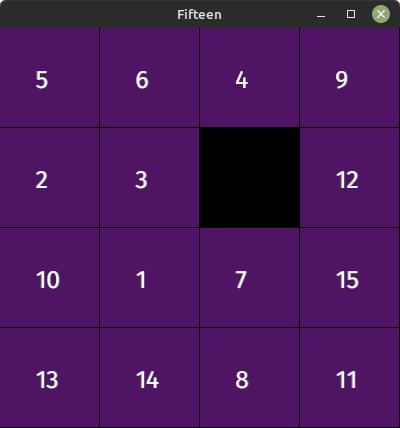

# rust-fifteen
Fifteen puzzle game with piston engine.  
Goal of the game is to move the pieces in order from 1 to 15.

  

The empty square is moved around with the arrow keys.  
At game start the pieces are shuffled randomly.

# Dependency
Piston game engine https://www.piston.rs

# References
Fifteen puzzle in LUA https://simplegametutorials.github.io/love/fifteen